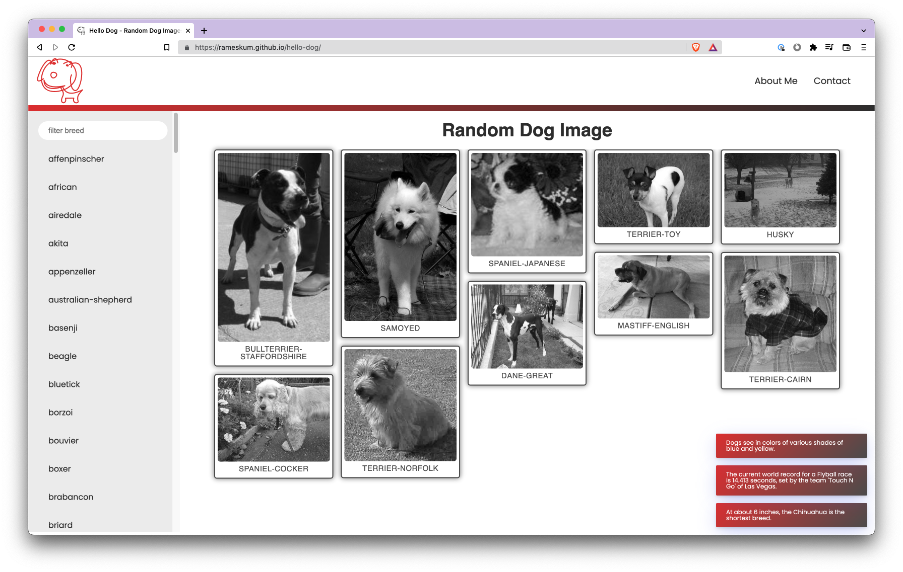

# hello-dog

Being a dog lover just I thought of creating a web application to show random dog images, as part of learning exercise.

This application is build with `javascript`, `css` and `html` only.

## Sample Image

## API

I'm using the internet's biggest collection of open source dog pictures - **Dog API**

[REPO](https://github.com/ElliottLandsborough/dog-ceo-api)
